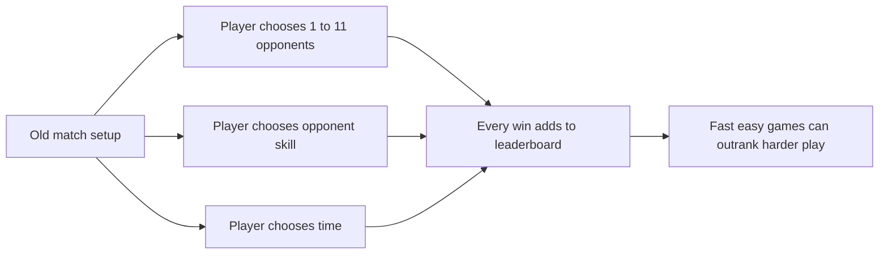
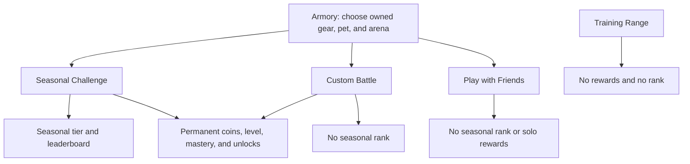
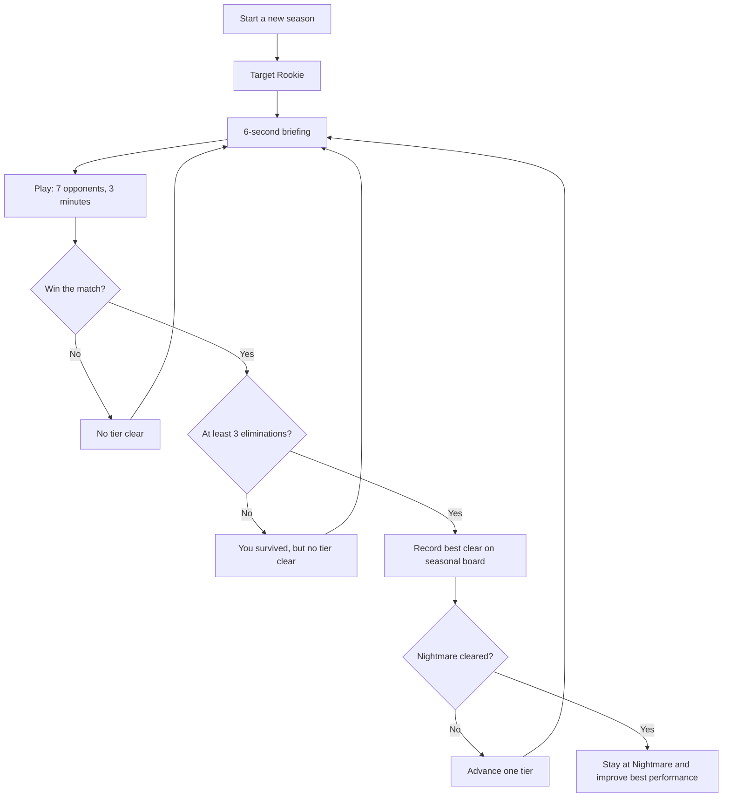
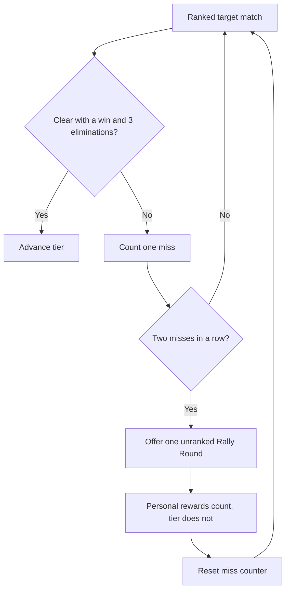

# Block Royale Fair Play, Challenge, and Seasons Decision Guide

**Purpose:** A plain-language discussion guide for deciding the next version of Block Royale with Ethan.

**Status:** The core fairness fix is implemented for testing on `codex/challenge-seasons`. It is not on `main` and has not changed the game used by current players.

**Data snapshot:** September 12, 2026 at 2:11 PM Pacific. The numbers will keep changing as players play.

**Proposed Season 1 start:** September 25, 2026

## 1. Recommendation in one minute

The old leaderboard is not a fair measure of skill. It rewards the number of wins, but players can choose the number and skill of their opponents. A quick match against one easy opponent can count the same as a difficult battle.

The simplest fix is to separate two jobs that were mixed together:

> **Seasonal Challenge measures skill. Custom Battle lets players experiment. Permanent fighter progress stays forever.**

Recommended first release:

1. Seasonal Challenge uses one clear, visible ruleset: 7 opponents, 3 minutes, and at least 3 eliminations in a win.
2. Custom Battle keeps all the familiar controls, including one-opponent games, presets, and Hunted Mode, but never changes the seasonal leaderboard.
3. One qualifying win clears a tier. Do not require three wins and do not promote players for accumulated damage.
4. Keep the first season simple. Collect standardized Challenge data before adding adaptive difficulty.
5. Discuss one optional relief rule: after two failed Challenge attempts, offer a clearly labeled, unranked Rally Round at an easier difficulty. It gives normal personal rewards but cannot promote the player.
6. Add only a few understandable achievements later. Achievements should create fun goals, not affect rank or combat power.

## 2. What problem did we find?

The original game treated a customizable match as both:

- a playground, where players choose the arena, opponent count, opponent skill, and time; and
- an evaluation, where wins move a player up the leaderboard.

Those goals conflict. A fair evaluation needs comparable conditions. A playground should allow freedom.



This is mainly a **game-design loophole**, not proof that children technically hacked the game. The rules made farming the easiest match a rational strategy.

There is a separate technical risk: the game runs client-side, so somebody using developer tools could edit a submission. The public data reviewed for this document cannot prove that happened. Server checks can reject impossible values and excessive submissions, but fully preventing client tampering would require server-authoritative gameplay, which is a much larger project.

## 3. Evidence from the current game

### 3.1 Overall activity

The public leaderboard contained:

| Measure | Observed value |
| --- | ---: |
| Players | 43 |
| Matches | 4,854 |
| Wins | 3,376 |
| Overall win rate | 69.6% |
| Eliminations | 10,015 |
| Median matches per player | 84 |
| Players with at least 100 matches | 16 |
| Players with at least 300 matches | 3 |
| Most matches by one player | 419 |

The high match counts matter because the old leaderboard accumulated wins. More repetitions could overcome a better performance.

| Lifetime matches | Players | Matches in group | Group win rate |
| --- | ---: | ---: | ---: |
| 1 to 9 | 5 | 32 | 46.9% |
| 10 to 49 | 8 | 263 | 58.2% |
| 50 to 99 | 14 | 1,070 | 61.8% |
| 100 to 299 | 13 | 2,288 | 71.1% |
| 300 or more | 3 | 1,201 | 76.7% |

This does not prove that playing more causes a higher win rate. It does show that a volume-based board strongly favors players who can repeat many games.

### 3.2 Named examples of the one-opponent pattern

For review, we used a deliberately narrow warning rule:

> At least 20 matches, at least a 75% win rate, and no more than 1.35 eliminations per match.

Three public fighter handles matched it:

| Fighter handle | Old board rank | Matches | Wins | Win rate | Eliminations per match | Eliminations per win |
| --- | ---: | ---: | ---: | ---: | ---: | ---: |
| CAPYBARA | 1 | 411 | 335 | 81.5% | 0.98 | 1.20 |
| LEVIFOR3 | 2 | 371 | 306 | 82.5% | 0.96 | 1.17 |
| MRBERKI | 15 | 96 | 79 | 82.3% | 1.13 | 1.37 |

Together, these three profiles produced 878 matches and 720 wins. That is 18.1% of all matches and 21.3% of all wins in the snapshot.

In the latest 40 public results, recorded over about one hour:

- 39 were wins;
- 35 were exactly one-elimination wins;
- LEVIFOR3 had 24 of those one-elimination wins;
- BENDYDIDTHINGS had 8; and
- ALBERT43 had 3.

This is strong evidence that very short or very small matches are being used to collect wins. It is not proof of intent, and the public recent feed does not expose opponent count. For that reason, this document calls the pattern **one-opponent-like farming**, not hacking.

### 3.3 The old ranking rewarded easy volume

| Old leaderboard band | Matches | Wins | Win rate | Eliminations per match | Eliminations per win |
| --- | ---: | ---: | ---: | ---: | ---: |
| Ranks 1 to 10 | 2,764 | 2,100 | 76.0% | 1.71 | 2.26 |
| Ranks 11 to 20 | 1,067 | 770 | 72.2% | 2.78 | 3.85 |
| Ranks 21 to 43 | 1,023 | 506 | 49.5% | 2.26 | 4.56 |

The top ten won much more often but averaged fewer eliminations per match and per win than the next groups. That is consistent with the board rewarding repeatable easy wins rather than only stronger performances.

### 3.4 Difficulty history is useful, but not a clean skill test

The feature-branch Preseason view shows the highest opponent skill used in any legacy win for 42 players:

```text
ROOKIE      ████████████████  16 players
REGULAR     ██████████        10 players
VETERAN     ████               4 players
ELITE       █                  1 player
NIGHTMARE   ███████████       11 players
```

| Highest legacy winning skill | Players | Players with 100+ matches | Median matches | Median best eliminations |
| --- | ---: | ---: | ---: | ---: |
| Rookie | 16 | 3 | 48 | 5 |
| Regular | 10 | 3 | 70.5 | 4 |
| Veteran | 4 | 3 | 187.5 | 3.5 |
| Elite | 1 | 1 | 231 | 1 |
| Nightmare | 11 | 6 | 102 | 2 |

Nine of the 16 players with at least 100 matches have not recorded a legacy win above Veteran. This supports the concern that many active players do not simply move to the hardest setting.

However, the strange jump from one Elite player to eleven Nightmare players is also a warning about the data. Legacy players could directly choose Nightmare and reduce the opponent count. A one-opponent Nightmare win could be easier than a full Rookie lobby. Therefore, this chart is **not a true difficulty curve** and should not be used to label a child's ability.

### 3.5 What the evidence cannot answer yet

There are no Season 1 Challenge results yet. The new fixed 7-opponent, 3-minute format has not generated a large enough dataset to tell us:

- what percentage clears Rookie in one, three, or five attempts;
- where players become frustrated or stop;
- how weapons, pets, and arenas affect a standardized clear;
- whether the 3-elimination rule is too easy or too hard at each tier; or
- whether an easier Rally Round actually improves return and learning.

Those are open measurement questions, not facts we should pretend to know.

## 4. The proposed game structure

Each mode should have one understandable purpose.



| Mode | Player job | Adjustable? | Permanent progress? | Seasonal leaderboard? |
| --- | --- | --- | --- | --- |
| Seasonal Challenge | Prove the hardest standard tier you can clear | No match setup; Armory choices still apply | Yes | Yes |
| Custom Battle | Experiment and play familiar presets | Yes | Yes | No |
| Play with Friends | Fight a friend | Room setup only | No solo rewards | No |
| Training Range | Test controls and weapons | Limited | No | No |

The player-facing explanation stays short:

> **Challenge counts. Custom does not. Your fighter progress stays forever.**

## 5. What is already implemented on the feature branch

The following behavior exists on `codex/challenge-seasons` for testing:

- Main menu entries are Seasonal Challenge, Custom Battle, Play with Friends, Armory, and How to Play.
- Training Range remains at the bottom of Match Setup, not on the main menu.
- Seasonal Challenge skips setup and shows a six-second launch briefing with ladder motivation and read-only rules.
- Challenge always uses 7 opponents and 3 minutes.
- Challenge automatically targets Rookie, Regular, Veteran, Elite, then Nightmare.
- The player clears a tier with one win and at least 3 eliminations.
- Surviving with fewer than 3 eliminations does not clear the tier.
- Custom Battle keeps the 1 to 11 opponent slider, the familiar opponent presets, difficulty, arena, time, and the optional red Hunted Mode warning.
- Custom results can still earn ordinary coins, XP, mastery, medals, and daily goals, but do not affect the seasonal leaderboard.
- Seasonal ranking uses one player's best qualifying clear, ordered by tier, eliminations, damage, then earliest achievement. Repeating easy wins does not accumulate standing.
- The database migration is additive. Old RPCs and the live `main` client still work.
- Existing coins, Fighter Level, gear, pets, arenas, mastery, saves, lifetime statistics, and old match history are preserved.
- The old leaderboard remains visible as Preseason history. Season 1 is scheduled for September 25 through October 23, 2026.

The following are **not** implemented:

- Rally Rounds or mixed-difficulty relief matches;
- starting a new season from the previous season's tier;
- new achievement badges for Hunted Mode or collecting gear;
- server-authoritative solo combat; and
- deployment of this branch to `main`.

## 6. How Challenge difficulty works right now

There is no hidden difficulty adjustment. Every player sees the same sequence, and one clear advances one step.



This is intentionally simpler than requiring several wins or a damage total:

- Requiring three wins per tier would turn five tiers into a minimum of 15 wins. That is unnecessary grind for a middle-school audience.
- Total damage is affected by weapon, pet, arena hazards, match events, and how much bots damage one another. It is useful feedback and a tie-breaker, but not a clean promotion rule.
- One win plus three eliminations is visible, memorable, and prevents hiding from being the best strategy.

## 7. Should difficulty be mixed like a mobile game?

The design goal is good: players need some relief after repeated losses. The risky part is silently changing the rules inside a ranked Challenge. If the game secretly makes some attempts easier, Challenge Tier stops meaning the same thing for everyone.

Recommended compromise for discussion:

### Optional Rally Round

After two failed attempts at the current target tier, offer one clearly labeled **Rally Round**:

- If the target is Regular or above, use the next easier opponent skill.
- If the target is Rookie, use 5 Rookie opponents instead of 7.
- Keep normal coins, XP, mastery, medals, and daily goals.
- Do not allow a Rally Round to clear a tier or change the leaderboard.
- Return to the same target tier afterward. Never demote the player.
- Explain it in one sentence: **"Rally Round: build momentum. Rewards count; rank does not."**



This keeps the competitive test standardized while giving a player an occasional confidence-building game. It is still pending because the first Season 1 data may show that Rookie is already approachable without it.

### Starting later seasons

For Season 1, everyone should start at Rookie because legacy results were not standardized.

For Season 2 and later, discuss starting each player one tier below the highest tier they cleared in the previous season. This avoids boring experts with repeated Rookie games while still asking them to prove themselves again. Do not implement this until Season 1 shows that tier clears are trustworthy.

## 8. Achievements without another confusing system

The game already has coins, Fighter Level, unlocks, weapon mastery, medals, daily challenges, and Challenge Tier. Adding a new currency or complicated achievement tree would mix too many systems.

If achievements are added, reuse the existing medal/profile presentation and start with only three visible goals:

| Achievement | Where earned | Meaning | Affects rank or power? |
| --- | --- | --- | --- |
| Hunted Survivor | Win a Custom Hunted match with at least 7 opponents and 3 eliminations | Took on the scary special mode | No |
| Arsenal Complete | Unlock every weapon | Explored long-term Armory progression | No |
| Nightmare Clear | Clear Nightmare in Seasonal Challenge | Reached the top competitive tier | Rank already reflects it; no extra power |

These goals motivate different kinds of play without making Custom Battle secretly competitive. Add them after the Challenge rules are understood, not in the same first release.

## 9. Bot-on-bot combat and hiding

Keep bot-on-bot combat enabled in Challenge.

It is part of the battle-royale identity and the current AI balance. Turning it off would make every Challenge a player-versus-seven ambush and would require a major AI rebalance. The 3-elimination requirement is the simpler anti-hiding rule: the player may use positioning, but cannot win the Challenge by letting bots do all the work.

Hunted Mode remains Custom only. In that mode every living bot targets the player and ignores other bots and pets as targets. Because it is unranked, players can choose the scary experience without changing the fairness of the ladder.

## 10. Seasons and progress

Use four-week seasons. Two weeks is easy to miss because of school, travel, or device access. Four weeks refreshes competition while giving players enough chances to participate.

Only seasonal Challenge standing starts fresh. Never reset:

- coins;
- XP or Fighter Level;
- owned and equipped gear;
- weapon mastery;
- pets, food, cosmetics, or arenas;
- lifetime match statistics; or
- account and club membership.

Preseason preserves the old board as history, but it should be labeled **Legacy rules** so nobody mistakes it for a fair comparison with Season 1.

## 11. Decisions to make with Ethan

| Decision | Recommended answer | Why | Status |
| --- | --- | --- | --- |
| Should Custom games count on the leaderboard? | No | Adjustable games cannot be compared fairly | Implemented on feature branch |
| Is one win plus 3 eliminations enough to clear a tier? | Yes for Season 1 | Simple and avoids a 15-win grind | Implemented on feature branch |
| Should bots fight each other in Challenge? | Yes | Keeps battle-royale play and avoids a large AI rebalance | Implemented behavior |
| Should we add a Rally Round after two misses? | Maybe, test after initial play sessions | Gives relief without changing ranked rules | Open discussion |
| Should Season 2 start one tier below last season's best? | Likely yes | Reduces boring early games for skilled players | Decide after Season 1 data |
| Should achievements affect the leaderboard? | No | Interesting goals and competitive skill are different | Open, recommendation only |
| Should the first achievements be Hunted Survivor, Arsenal Complete, and Nightmare Clear? | Yes, but later | Covers Custom, long-term collection, and Challenge with only three ideas | Open discussion |
| Should Season 1 launch on September 25? | Only after a small playtest confirms clarity and preservation | Main is currently protected | Pending approval |

## 12. Season 1 test and learning plan

Before moving the feature branch to `main`, verify:

1. A one-opponent Custom win never changes the seasonal board.
2. A Challenge win with fewer than 3 eliminations does not clear a tier.
3. A valid clear advances exactly one tier.
4. Repeating a weaker result does not improve leaderboard place.
5. Old saves, coins, equipment, mastery, and history remain intact.
6. A player can explain the system as, "Challenge counts; Custom doesn't."

During Season 1, collect these simple measures by tier:

- attempts before first clear;
- percentage clearing within 1, 3, and 5 attempts;
- eliminations, damage, match duration, and result;
- whether a player immediately retries, switches to Custom, or leaves; and
- weapon, pet, and arena used, so one loadout does not silently dominate.

Suggested design guardrail, not an observed fact:

> About 70% of participating players should be able to clear Rookie within three standard attempts.

If far fewer can, tune Rookie before adding grind. If almost everyone clears it immediately, consider a faster starting point in later seasons. Do not change several rules at once, or we will not know what solved the problem.

## 13. Evidence limits and data definitions

This review used the game's public, read-only Supabase functions:

- `sr_board` for lifetime player totals and the legacy rank;
- `sr_recent` for the latest 40 public match results;
- `sr_board_v2` for Preseason legacy difficulty history and the empty Season 1 board; and
- `sr_season_status` for the server-controlled season dates.

Important limits:

- The public recent feed does not include opponent count, time limit, full loadout, or a replay.
- Aggregate profiles can identify an unusual pattern, but not motivation or technical tampering.
- Legacy difficulty was player-selected and could be paired with any opponent count. It is not a standardized skill result.
- Only 43 public profiles are represented, so small groups can move percentages substantially.
- This is a live snapshot. Record the query time whenever numbers are discussed later.

The right conclusion is not, "These children cheated." The evidence-backed conclusion is:

> **The old rules made easy-win farming possible and valuable. The leaderboard should stop rewarding it.**

## 14. Deliberate boundaries

This plan does not require:

- changing familiar Custom presets;
- redesigning the Armory;
- rebalancing every weapon, pet, map, or reward;
- deleting old results or player progress;
- disabling bot-on-bot combat;
- ranking Friends PvP;
- adding a season pass or new currency; or
- rewriting the entire solo game to run on a server.

These boundaries let us fix the fairness problem without making the game unfamiliar.
